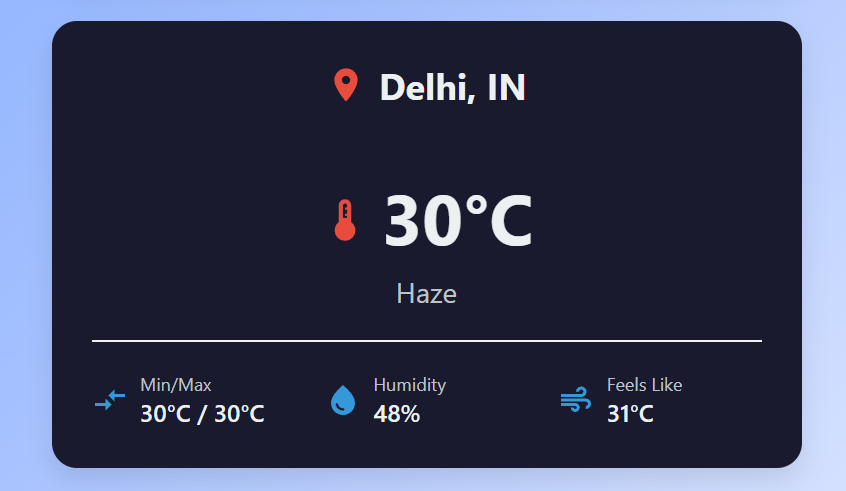
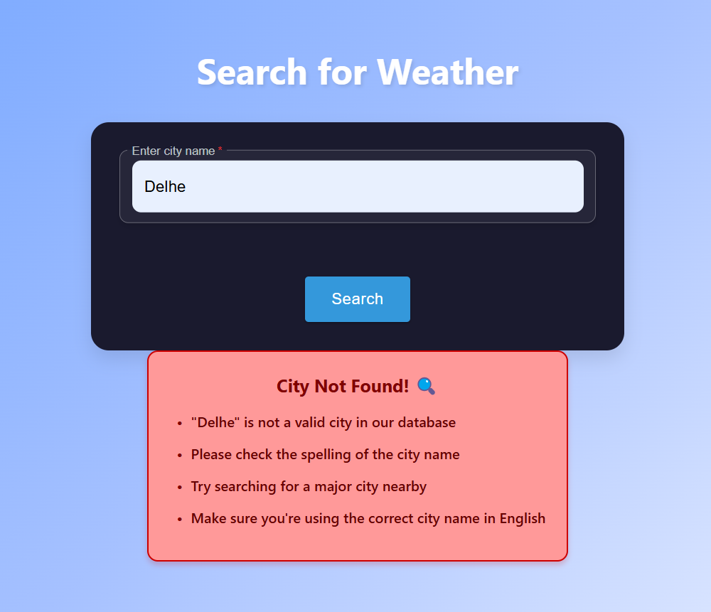

# 🌤️ Weather App

A sleek and responsive weather application that provides users with up-to-date weather information for cities worldwide. Built with React, Vite, and Material-UI, this app combines intuitive design with powerful functionality, delivering weather details in real-time.

---

## 🌟 Features

- 🌍 **Real-Time Weather Information**  
  - Current Temperature displayed in an easy-to-read format.
  - Humidity, Wind Speed, and Weather Conditions for detailed weather insights.
  - City Search Functionality allowing you to check weather details globally.

- 📱 **Responsive Design**  
  Fully optimized for Desktop, Tablet, and Mobile Devices for seamless use across platforms.

---

## 🛠️ Technologies Used

- **React 18**: A fast, component-based JavaScript library for building user interfaces.
- **Vite**: A rapid development build tool that ensures fast loading times.
- **Material-UI**: A design library providing stylish, responsive components.
- **OpenWeather API**: Powers the app with accurate and real-time weather data.

---


## Screenshots

Here are some screenshots of the weather app:

### Screenshot 1


### Screenshot 2


### Screenshot 3



## Installation Guide

Follow these steps to run the project locally:

### 1. Clone the Repository
```bash
git clone https://github.com/2016archana/React-Weather-Project.git
```

### 2. Navigate to the Project Directory
```bash
cd React-Weather-Project
```

### 3. Install Dependencies
```bash
npm install
```

### 4. Set Up API Key
- Create a `.env` file in the root directory.
- Add your OpenWeatherMap API key to the file:
```bash
VITE_API_KEY=your_api_key_here
```

### 5. Start the Development Server
```bash
npm run dev
```
The application should now be running on http://localhost:5173.

## How to Get an API Key
1. Go to [OpenWeatherMap](https://openweathermap.org/).
2. Create a free account.
3. Navigate to the API keys section.
4. Copy your API key.
5. Paste it in the `.env` file as described in the installation guide.

## Technologies Used
- **React.js**: JavaScript library for building user interfaces.
- **OpenWeatherMap API**: Provides real-time weather data.
- **CSS3**: For styling and layout.
- **JavaScript (ES6+)**: Modern JavaScript features.

## Project Structure
```
React-Weather-Project/
  ├── Weather/                    # Main application folder
  │   ├── src/                    # Source files
  │   │   ├── App.jsx            # Main application component
  │   │   ├── SearchBox.jsx      # Search functionality
  │   │   ├── WeatherInfo.jsx    # Weather information display
  │   │   └── InfoCard.jsx       # Information card component
  │   ├── public/                # Public assets
  │   ├── .env                   # Environment variables
  │   └── package.json           # Project dependencies
  └── README.md                  # Project documentation
```

## Key Features Explained

### 1. Weather Search
- Allows users to search for weather in any city worldwide.

### 2. Real-time Data
- Fetches live data from OpenWeatherMap API to display current weather conditions.

### 3. Detailed Weather Information
Displays key weather details:
- Temperature
- Humidity
- Wind Speed
- Weather Description (e.g., clear sky, cloudy)
- Weather Icon for visual representation of conditions

## API Response Format
The OpenWeatherMap API responds with data in the following format:
```json
{
  "weather": [
    {
      "main": "Clear",
      "description": "clear sky",
      "icon": "01d"
    }
  ],
  "main": {
    "temp": 20.5,
    "humidity": 65
  },
  "wind": {
    "speed": 3.6
  }
}
```

## Author
- Archana Patel
- GitHub: [@2016archana](https://github.com/2016archana)

## License
This project is open-source and available under the MIT License.

## Contributing
Pull requests are welcome! For major changes, please open an issue first to discuss your proposed changes.

## Acknowledgments
- OpenWeatherMap API: For providing the weather data.
- React Community: For excellent documentation and resources that made building this app possible.
